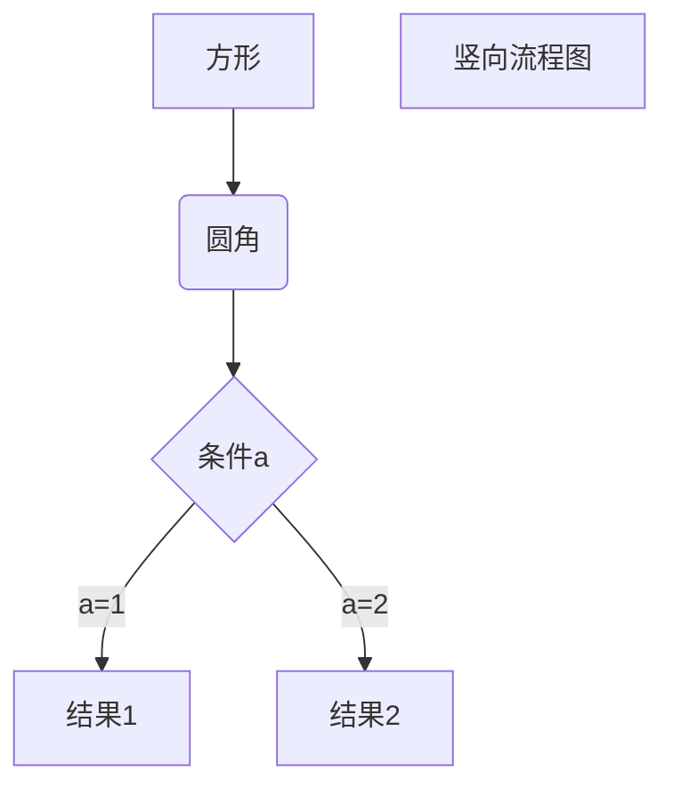

# *背景*
进度条倒计时动画，当前页面不被杀死的前提下，进入子页面再次返回，进度条进度需扣减子页面的停留时间

# *解决思路*
监听浏览器返回事件，重新render进度条倒计时动画组件

# *浏览器事件触发顺序*
pageshow

```mermaid
graph TD
A[方形] --> B(圆角)
    B --> C{条件a}
    C --> |a=1| D[结果1]
    C --> |a=2| E[结果2]
    F[竖向流程图]
```